# Skill 生产框架

本框架把“如何生成 Skill”和“如何执行 Skill”拆成两个相互咬合的系统：生成期负责把规范编译成确定性契约，运行期负责按能力 ID 执行、留收据、校验并晋级交付物。模型负责分析与写作，不负责临时发明工具或校验器。

```mermaid
flowchart LR
    subgraph Factory["Skill Factory · 生成期"]
        A["1. 技能生成规范<br/>SKILL.md + agents/openai.yaml"] --> B["能力构建与注册<br/>capabilities.yaml"]
        B --> C["2. 工具管理<br/>能力 ID / 权限 / 副作用 / 前置收据"]
        A --> D["输出要求声明<br/>outputs.yaml"]
        D --> E["动态匹配校验器<br/>按输出类型、特征和领域契约编译"]
        E --> F["确定性 gate-plan.json"]
        C --> G["Factory lint<br/>名称、入口、terminal 所有权、引用对齐"]
        F --> G
    end

    subgraph Runtime["Production Runtime · 执行期"]
        H["任务意图"] --> I["3. 工具使用<br/>按 capability ID 调用"]
        I --> J["前置检查<br/>环境变量 + 同日依赖收据"]
        J --> K["执行原子能力"]
        K --> L["写入 .staging<br/>记录输入、输出与 SHA-256 收据"]
        L --> M["4. 输出校验<br/>执行已编译 gate plan"]
        M -->|"全部通过"| N["原子晋级正式路径"]
        N --> O["交付<br/>artifact + run_id + audit + gate_pass"]
        M -->|"失败"| P["阻断发布与 cleanup<br/>保留 staging / evidence / audit / receipt"]
    end

    G --> H
```

## 生成期职责

- `SKILL.md` 保留运行机制、领域方法与人在环边界；脚本只做确定性“手部动作”。
- `capabilities.yaml` 是工具注册表：入口、能力 ID、副作用、环境依赖、前置收据和 terminal 所有权都在这里声明。
- `outputs.yaml` 按输出 ID 声明路径、类型、结构、证据要求、源产物关系和领域校验。
- `scripts/skill_factory.py` 根据输出类型与特征自动选择基础校验器，再叠加领域校验，生成稳定的 `gate-plan.json`。运行时不能让模型增删校验器。

## 运行期职责

- `shared/skill_runtime/runner.py` 是生产入口。非终端能力也留执行收据；终端能力必须先落 `.staging`。
- 模型撰写的 Markdown 由内置 `finalize` 能力接管；HTML 等脚本产物由运行时注入暂存输出路径。
- `shared/output_gate/gate.py` 依序验证路径、大小、编码、结构、禁用表达、证据日期与引用、源收据、文本保全和浏览器 attestation。
- 只有硬门禁全绿才调用 `os.replace` 原子晋级。最终交付再次核对产物 SHA-256、audit SHA-256、成功收据和 `gate_pass`。

## 当前迁移范围

`skill-framework.yaml` 只纳管两个存量 Skill：

- `a-stock-daily-market-sense`
- `ch-news-reporter`

其他存量 Skill 本轮不增加声明、不修改工作流；共享 Factory/Runtime 作为后续增量 Skill 的基础设施。
